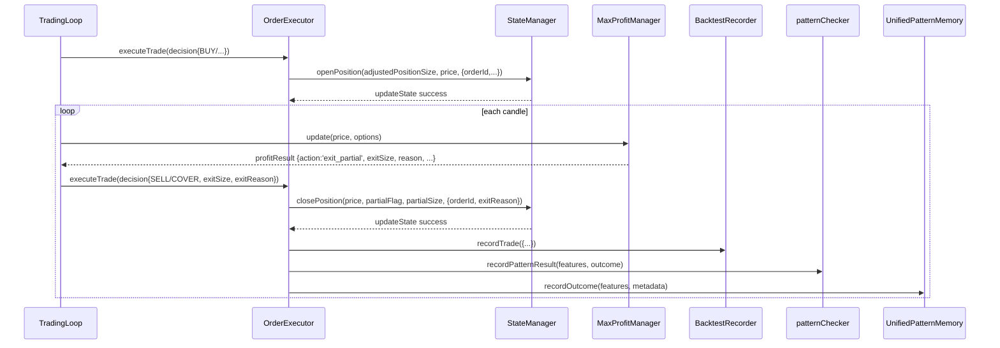

# Forensic source audit of OGZPMLV2 trade lifecycle

## Executive summary

A single trade’s “lifecycle” in this branch is not primarily a broker-order lifecycle; it is a **StateManager activeTrades Map lifecycle** plus a **decision loop** that routes entry/exit decisions into `OrderExecutor.executeTrade()`, which then calls `StateManager.openPosition()` and `StateManager.closePosition()` for state mutation. citeturn45view1turn28view0

The code contains **a complete tiered-exit engine** (`MaxProfitManager`) that *does* generate repeated “partial exit” recommendations and maintains internal fields like `remainingSize` and `realizedPnL`. citeturn32view2turn32view4turn33view2  
But the rest of the pipeline does **not** implement a true multi-leg lifecycle in actual state. Two independent breaks occur:

- **Unit contract mismatch:** `MaxProfitManager` computes `exitSize` as an **absolute size** (`originalSize * tier.exit`), and `TradingLoop` forwards that value directly as `decision.exitSize`. citeturn33view2turn38view5  
  `OrderExecutor` then treats `decision.exitSize` as something you multiply by the current position amount to compute a size to close (`partialSize = positionAmount * decision.exitSize`), implying it is acting like a **fraction**. citeturn44view1  
  **VERIFIED IN SOURCE:** the producer and consumer do not share a consistent `exitSize` unit. citeturn33view2turn38view5turn44view1

- **StateManager ignores partial size and removes the trade anyway:** `StateManager.closePosition(price, partial=false, size=null, ...)` looks up the trade by `tradeId`, then computes `closeSize` from the stored trade’s full size (`trade.sizeUsd || trade.size`) and proceeds to delete that trade from `activeTrades`. The `size` parameter (the “partial close amount”) is not used to set `closeSize`. citeturn21view7turn26view5turn27view1turn27view2  
  **VERIFIED IN SOURCE:** even on a “partial” close call, the function closes and accounts for the entire stored trade size and removes the trade from `activeTrades`. citeturn26view5turn27view1turn28view0

Net effect: **multi-leg exits are “implemented” only inside MaxProfitManager’s private state, but not in the platform’s trade state-of-record (StateManager).** The trade is removed from `activeTrades` on the first exit call, so there is no trade object left to receive subsequent exit legs. citeturn27view1turn28view0turn33view2

Additional high-impact finding: `OrderExecutor` calls `getUnifiedPatternMemory().recordOutcome(...)` and passes `pnlPercent: pnl` (same value as `pnl`). This is a likely field/meaning mismatch at the call boundary. citeturn44view7

## Scope and methodology

This audit begins at a concrete entry point: **a BUY entry decision reaching `core/OrderExecutor.executeTrade()`**, then follows the call graph through the modules that the trade touches (entry state creation, decision loop, exit execution, and post-exit recording). The “trade object” referenced in this report is the object constructed and stored by `StateManager.openPosition()` in `state.activeTrades`. citeturn21view0turn23view0turn21view5

Primary traced files (branch `broker/alpaca-integration`):

- `core/TradingLoop.js` (decision loop, including MaxProfitManager exit decisions). citeturn38view2turn38view5  
- `core/OrderExecutor.js` (entry/exit execution and cross-module notifications/recording). citeturn44view0turn44view1turn44view6turn44view7  
- `core/StateManager.js` (single source of truth for trade state creation and close behavior). citeturn21view0turn21view1turn23view0turn28view0  
- `core/MaxProfitManager.js` (tiered exits / partial exit recommendation generator). citeturn32view2turn33view2turn32view4  
- `core/BacktestRecorder.js` (exit-side trade recording; fees and P&L accounting). citeturn43view1turn43view2

Also reviewed for existence/contract expectations:

- `core/TradeJournal.js` exists and exports a class, but “recordEntry/recordExit” appear in comments; I could not locate executable method definitions by name via in-repo string search results captured here. **UNCERTAIN** (details below). citeturn42view2turn44view8

Limitations (explicit): I did not expand the broker-specific order-submission chain (e.g., `OrderRouter`) because the asked lifecycle here is traceable end-to-end from **decision → per-trade state birth → per-trade state death** inside StateManager and the decision loop. If you need “wire-to-broker” lifecycle (request creation → broker API submission → fill callbacks → reconciliation), that is a separate trace starting from `core/OrderRouter.js`/adapters, not from `StateManager`. **UNCERTAIN** unless that trace is requested explicitly.

## Entry lifecycle from BUY decision to trade birth

**Q1 (trade fields set on entry): VERIFIED IN SOURCE**

### The trade object is constructed in StateManager.openPosition

The trade object is created inside `StateManager.openPosition(size, price, context = {})`. citeturn21view0  
At trade birth:

- `tradeId` is chosen as `context.orderId` or a generated `TRADE_${Date.now()}`. **VERIFIED.** citeturn22view3  
- `tradeAction` is `context.action || 'BUY'`. **VERIFIED.** citeturn22view4  
- The stored trade fields include:

| Field on stored trade (`const trade = { ... }`) | Where set | Status |
|---|---:|---|
| `id` | `id: tradeId` | VERIFIED IN SOURCE citeturn22view0 |
| `action` | `action: tradeAction` | VERIFIED IN SOURCE citeturn22view0 |
| `type` | `type: tradeAction` | VERIFIED IN SOURCE citeturn23view0 |
| `direction` | `direction: tradeDirection` | VERIFIED IN SOURCE citeturn23view0 |
| `sizeUsd` | `sizeUsd: size` | VERIFIED IN SOURCE citeturn23view0 |
| `size` | `size: size` | VERIFIED IN SOURCE citeturn23view0 |
| `price` | `price: price` | VERIFIED IN SOURCE citeturn22view1 |
| `entryPrice` | `entryPrice: price` | VERIFIED IN SOURCE citeturn22view1 |
| `entryFee` | `entryFee: entryFee` | VERIFIED IN SOURCE citeturn22view1 |
| `entryTime` | `entryTime: Date.now()` | VERIFIED IN SOURCE citeturn22view1 |
| `timestamp` | `timestamp: Date.now()` | VERIFIED IN SOURCE citeturn22view1 |
| `status` | `status: 'open'` | VERIFIED IN SOURCE citeturn22view1 |
| `...context` | spread into trade | VERIFIED IN SOURCE citeturn22view1 |

This `...context` spread is critical: **any key passed by the caller to `openPosition()` becomes a first-class field on the stored trade object** unless overwritten by the base fields above. **VERIFIED.** citeturn22view1

### Who passes “context” into openPosition for a BUY?

`OrderExecutor` calls `await stateManager.openPosition(adjustedPositionSize, price, { ... })` (long/buy path) and includes at least:

- `orderId: unifiedResult.orderId` **VERIFIED.** citeturn45view1  
- `exitContract: exitContract` **VERIFIED** (shown in the call’s trailing portion). citeturn45view0  
- `ledgerData: decision.ledgerData || null` **VERIFIED** (shown in the call’s trailing portion). citeturn45view0  

The full context object for the BUY path includes additional keys above line 275 that are not visible in the captured snippet here; therefore the *complete* list of extra trade fields coming from `...context` is **UNCERTAIN** from this evidence alone. What resolves the uncertainty: a full extraction of the call block around `core/OrderExecutor.js:273–286` to enumerate the entire literal object passed. citeturn45view1turn45view0

### Trade ownership and per-trade state modules

**Q1 (modules instantiating/owning per-trade state): VERIFIED + UNCERTAIN mixed**

- **StateManager owns the canonical trade object** by inserting it into `this.state.activeTrades` (a `Map`) with key `tradeId`. **VERIFIED.** citeturn21view5  
- **StateManager also mutates global scalar state** (position, entryPrice, realizedPnL, inPosition, counters) on open. The update includes:  
  `position`, `positionCount`, a weighted `entryPrice`, `entryTime`, `realizedPnL` decreased by `entryFee`, `inPosition` increased by `usdCost`, `lastTradeTime`, `tradeCount`, `dailyTradeCount`. **VERIFIED.** citeturn25view1turn25view2turn25view3  
- **OrderExecutor owns a per-instance `pendingTraiDecisions` Map and a `tradeExitCount` counter** (local state). This is per-OrderExecutor, not per-trade, but it stores per-trade keyed data. **VERIFIED.** citeturn45view7  
- **MaxProfitManager owns per-position internal state**, including tier completion and `remainingSize`; but it is a single instance (not keyed by tradeId in the code shown) and therefore only “per-trade” if the system is single-position at a time. **VERIFIED internal per-position fields, but per-trade scoping is UNCERTAIN without a multi-position mapping.** citeturn32view2turn32view4turn37view2  

**Q1 (list every module that holds a reference to the trade object):**

Verified references (in this trace):

- `core/StateManager.js` holds the trade object in `state.activeTrades` and later retrieves it by `tradeId` during close. citeturn21view5turn26view4  
- `core/TradingLoop.js` holds a live reference as `activeTrade` when building exit decisions using `activeTrade.direction`, `activeTrade.action`, and `activeTrade.id`. citeturn38view0  
- `core/OrderExecutor.js` holds a live reference as `buyTrade` when closing (it passes `buyTrade.orderId` into `StateManager.closePosition`) and also reads `buyTrade.entryStrategy/strategy` when recording outcomes. citeturn44view1turn44view7  

Modules that likely touch trade data but for which “holds a reference” is **UNCERTAIN** from the captured evidence:

- `core/ExitContractManager.js` is implicated by `TradingLoop` exit decisions but its concrete parameter contract isn’t shown in the extracted snippet set here. What resolves: open/trace `ExitContractManager.checkExit(...)` and its call site signature in `TradingLoop`. citeturn38view0

## Exit lifecycle from exit decision to state close

This branch has two distinct exit-decision origins in the decision loop:

- “Exit contract” decisions (`ExitContractManager`-driven) that produce a full close decision with explicit `tradeId`. citeturn38view0  
- “Profit management” decisions (`MaxProfitManager`-driven) that can yield `exit_partial` or `exit_full` and provide an `exitSize` payload. citeturn38view2turn32view2  

**Q2 (partial exit lifecycle trace): VERIFIED IN SOURCE, with explicitly noted breakpoints**

### Where the partial-exit decision originates

`MaxProfitManager.update(currentPrice, options)` returns an object when a profit tier triggers:

```js
return {
  action: 'exit_partial',
  price: currentPrice,
  exitSize: tierExit.exitSize,
  remainingSize: this.state.remainingSize,
  reason: `profit_tier_${tierExit.tier}`,
  profitPercent: profitPercent,
  tier: tierExit.tier
};
```

This is **VERIFIED** at `core/MaxProfitManager.js:501–510` (file line numbers as shown in blame output). citeturn32view2

Internally, tier exit sizes are computed during tier setup as:

- `exitPercentage: tier.exit`
- `exitSize: this.state.originalSize * tier.exit`

**VERIFIED** at `core/MaxProfitManager.js:622–624`. citeturn33view2

### What payload/fields are passed downstream

In `TradingLoop`, when `profitResult.action` is `'exit_full'` or `'exit_partial'`, a SELL/COVER decision is built that forwards:

- `exitSize: profitResult.exitSize`
- `exitReason: profitResult.reason`

**VERIFIED** at `core/TradingLoop.js:184–193` and specifically the `exitSize/exitReason` lines. citeturn38view3turn38view5

### What each downstream module does with that payload

#### OrderExecutor consumes decision.exitSize and calls StateManager.closePosition

In `OrderExecutor`, on the close path, the code computes a `partialSize` (guarded by `isPartialClose`) as:

- `partialSize = isPartialClose ? positionAmount * decision.exitSize : null`

…and then calls:

- `stateManager.closePosition(price, isPartialClose, partialSize, { orderId: buyTrade.orderId, exitReason: decision.exitReason || 'signal' })`

**VERIFIED** at `core/OrderExecutor.js:594–600` (with the `partialSize` expression appearing immediately before the call in the same snippet). citeturn44view1turn44view2turn44view5

This establishes an implied consumer contract: `decision.exitSize` is treated as something you multiply by the full position size to get a close amount. **VERIFIED by the expression used.** citeturn44view1

#### StateManager.closePosition ignores the size parameter and closes the stored trade size

`StateManager.closePosition` signature includes `size = null`, but the internal `closeSize` is computed as:

- `const tradeSizeUsd = trade.sizeUsd || trade.size;`
- `const closeSize = Math.abs(tradeSizeUsd);`

**VERIFIED** at `core/StateManager.js:462–466`. citeturn26view5

So the “size” argument (the third positional argument) is not used to determine closed size in the shown code path. **VERIFIED.** citeturn26view5turn21view7

StateManager then deletes the tradeId entry from activeTrades:

- `this.state.activeTrades.delete(tradeId);`

**VERIFIED** at `core/StateManager.js:490–492`. citeturn27view1turn27view2

And reduces `inPosition` and updates realizedPnL based on `closeSize` (the stored trade size):

- `inPosition: Math.max(0, this.state.inPosition - closeSize),`
- `realizedPnL: this.state.realizedPnL + netRealizedResult,`
- plus other fields.

**VERIFIED** at `core/StateManager.js:539–548` and surrounding. citeturn28view0

### What state is mutated where

**VERIFIED IN SOURCE:**

- `StateManager.state.activeTrades` is mutated:
  - On entry: `activeTrades.set(tradeId, trade)` citeturn21view5  
  - On close: `activeTrades.delete(tradeId)` citeturn27view1  

- `StateManager.state` scalar fields are mutated:
  - On entry: `position`, `positionCount`, `entryPrice`, `entryTime`, `realizedPnL`, `inPosition`, `lastTradeTime`, `tradeCount`, `dailyTradeCount`. citeturn25view2turn25view3  
  - On close: `position`, `positionCount` (special casing for `partial`), `entryPrice` (special casing), `entryTime` (special casing), `inPosition`, `realizedPnL`, `totalPnL`, `lastTradeTime`. citeturn28view0  

- `MaxProfitManager.state` internal fields mutate on partial-exit execution:
  - `this.state.remainingSize -= tierExit.exitSize;`
  - `this.state.realizedPnL += realizedProfit;`

**VERIFIED** at `core/MaxProfitManager.js:691–696`. citeturn32view4

### What state is NOT mutated that you would expect to be

**VERIFIED IN SOURCE:** there is no mutation that reduces the stored trade’s `sizeUsd`/`size` on a partial exit because:

1) StateManager does not use the `size` argument to compute `closeSize`; it uses the stored trade size. citeturn26view5  
2) StateManager deletes the stored trade from `activeTrades`, so there is no remaining in-map trade to update. citeturn27view1  

This means a “partial exit” call does not result in a “trade still open with reduced size” state in StateManager. **VERIFIED.** citeturn26view5turn27view1turn28view0

**Q3 (multi-leg lifecycle support): VERIFIED that it exists in MaxProfitManager; VERIFIED that it breaks at StateManager**

- **Yes, a multi-leg lifecycle mechanism exists in MaxProfitManager:** tiers are created (`this.state.tiers.push(...)`), have a `completed` flag, and `exitSize` is computed per-tier; `executePartialExit` decrements `remainingSize`. citeturn33view2turn32view4  
- **No, the platform’s trade state does not support multi-leg lifecycle end-to-end:** the close pathway removes the trade from `activeTrades` and accounts as if the full stored size is closed. citeturn26view5turn27view1turn28view0  

Where it breaks down (literal breakpoint):

- `StateManager.closePosition` signature encourages partial close via `(partial, size)`, but internally `closeSize` is derived from the stored trade’s full size and the trade is deleted. citeturn21view7turn26view5turn27view1  

## Call graph and timeline of a single trade

### Call graph

```mermaid
graph TD
  TL[core/TradingLoop] -->|decision| OE[core/OrderExecutor.executeTrade]
  OE -->|openPosition(adjustedPositionSize, price, context)| SMOP[core/StateManager.openPosition]
  TL -->|profitResult = update(price, ...)| MPMU[core/MaxProfitManager.update]
  MPMU -->|{action:'exit_partial', exitSize, reason}| TL
  TL -->|decision.exitSize = profitResult.exitSize| OE
  OE -->|closePosition(price, isPartialClose, partialSize, {orderId,...})| SMCP[core/StateManager.closePosition]
  OE -->|recordTrade(trade)| BTR[core/BacktestRecorder.recordTrade]
  OE -->|recordPatternResult(features, outcome)| PC[ctx.patternChecker.recordPatternResult]
  OE -->|recordOutcome(features, metadata)| UPM[getUnifiedPatternMemory().recordOutcome]
```

This call graph is reconstructed from literal call sites in `TradingLoop`, `OrderExecutor`, `MaxProfitManager`, and `StateManager`. citeturn38view2turn38view5turn45view1turn44view1turn32view2turn26view5turn44view6turn44view7

### Timeline



Backed by explicit calls in file shown above. citeturn38view2turn38view5turn44view1turn45view1turn32view2turn44view6turn44view7

## Module contract verification and mismatches

**Q4 (caller assumptions vs module behavior):**

### StateManager.closePosition

- **Caller-facing signature implies** it can do partial closes via `(partial=true, size=<amount>)`:  
  `async closePosition(price, partial=false, size=null, context={})` **VERIFIED.** citeturn21view7  
- **Actual behavior in code:**
  - Requires a `tradeId` (`context.tradeId || context.orderId`) and fails otherwise. citeturn26view3turn26view4  
  - Looks up trade by `tradeId` from `activeTrades`. citeturn26view4  
  - Computes `closeSize` from the stored trade’s `sizeUsd || size` and **does not use the `size` argument** to determine close size. citeturn26view5  
  - Deletes the trade from `activeTrades` for that `tradeId`. citeturn27view1  
  - Updates state fields (including `inPosition`) by `closeSize` (the full stored trade size). citeturn28view0  

**Finding:** The caller can pass `partial=true` and a `size`, but the callee still closes and accounts against the full stored trade size and removes the trade in-map. **VERIFIED IN SOURCE.** citeturn26view5turn27view1turn28view0

### MaxProfitManager update/exit emission

- **Actual return contract:** when a tier triggers, `update()` returns an object with keys: `action`, `price`, `exitSize`, `remainingSize`, `reason`, `profitPercent`, `tier`. **VERIFIED.** citeturn32view2  
- **Internal state mutation:** `executePartialExit()` marks tiers completed and reduces `remainingSize` and increases `realizedPnL`. **VERIFIED.** citeturn32view4  
- **Exit size semantics:** tier exit sizes are computed as `originalSize * tier.exit`, i.e., a size in the same units as `originalSize`. **VERIFIED.** citeturn33view2  

**Finding:** `MaxProfitManager` is internally consistent about multi-leg exits, but it only emits a recommendation object; it does not mutate StateManager or execute broker legs itself. **VERIFIED IN SOURCE.** citeturn32view2turn32view4turn33view2

### TradeJournal.recordExit

- `TradeJournal.js` exists and exports `TradeJournal` class. **VERIFIED.** citeturn42view2  
- The string `TradeJournal.recordExit()` appears in a documentation block describing a data flow (ExecutionLayer/RiskManager). **VERIFIED.** citeturn44view8  
- I did not capture an executable `recordExit(...)` method body in the extracted evidence here; the search results shown repeatedly return the comment occurrence, not code. Therefore:

**Finding:** Whether `TradeJournal.recordExit` exists as an actual callable method in this branch is **UNCERTAIN** from this evidence alone. What resolves: open and enumerate methods around the “PUBLIC API” sections of `TradeJournal.js` and confirm method definitions. citeturn44view8turn43view3

### Pattern outcome recording systems

`OrderExecutor` has two post-exit recording calls:

- `this.ctx.patternChecker.recordPatternResult(featuresForRecording, {...})` with outcome fields including `pnl`, `holdDurationMs`, `exitReason`, and `timestamp`. **VERIFIED.** citeturn44view6  
- `getUnifiedPatternMemory().recordOutcome(featuresForRecording, {...})` wrapped in try/catch; if it fails, it logs `UnifiedPatternMemory.recordOutcome failed`. **VERIFIED.** citeturn44view7  

**Finding:** The caller (OrderExecutor) assumes `ctx.patternChecker` implements `recordPatternResult` and that UnifiedPatternMemory has an instance method `recordOutcome`. The UnifiedPatternMemory call is explicitly treated as fallible and may silently fail without aborting execution. **VERIFIED IN SOURCE for the call + swallow pattern; actual callee behavior is UNCERTAIN because UnifiedPatternMemory implementation wasn’t captured here.** citeturn44view6turn44view7

### BacktestRecorder.recordTrade

`BacktestRecorder.recordTrade(trade)` begins by treating `trade.size`/`trade.sizeUsd` as already USD:

- `const positionSizeUsd = trade.size || trade.sizeUsd || 1;` **VERIFIED.** citeturn43view2  

It also uses a fee model initialized as:

- `this.feePerSide = config.feePerSide || TradingConfig.get('fees.makerFee');`
- `this.roundTripFee = this.feePerSide * 2;`

**VERIFIED.** citeturn43view1  

**Finding:** The caller can pass any object; the recorder assumes `trade.size` is USD and computes fees using a symmetric “per-side” fee defaulting to makerFee. **VERIFIED.** citeturn43view1turn43view2

**Q5 (silent mismatches between emitter and consumer):**

### Verified mismatches

| Mismatch type | Producer → Consumer | What’s emitted | What’s consumed | Status |
|---|---|---|---|---|
| Unit mismatch | `MaxProfitManager.update().exitSize` → `TradingLoop decision.exitSize` → `OrderExecutor partialSize` | `exitSize = originalSize * tier.exit` (absolute units) citeturn33view2 | `partialSize = positionAmount * decision.exitSize` (implies fraction-like use) citeturn44view1 | VERIFIED IN SOURCE (mismatching semantics) citeturn33view2turn38view5turn44view1 |
| Lifecycle mismatch | `OrderExecutor` partial close call → `StateManager.closePosition` | passes `partial=true` and `size=partialSize` citeturn44view1 | `closeSize = abs(trade.sizeUsd||trade.size)` and deletes trade citeturn26view5turn27view1 | VERIFIED IN SOURCE |
| Field meaning ambiguity | `OrderExecutor` → UnifiedPatternMemory | passes `{ pnl: pnl, pnlPercent: pnl }` citeturn44view7 | Consumer likely expects `pnlPercent` to be a percent distinct from `pnl` | VERIFIED at call site; consumer expectation is UNCERTAIN |

### Expected-but-missing mutations (multi-leg mechanics)

A multi-leg lifecycle typically requires “remaining position size” to persist on the trade itself or in a per-trade state store. In this code:

- MaxProfitManager has `remainingSize`, but it is internal to a single manager instance. citeturn32view2turn32view4  
- StateManager has no partial-size reduction path for trade objects; it deletes the trade on close. citeturn27view1  

**VERIFIED mismatch:** tiered exits exist in one subsystem, but not in the canonical trade state. citeturn27view1turn33view2

## Bugs, architectural hazards, and incremental-design collisions

**Q6 (bugs found by source reading, ranked by severity):**

### Critical

**Partial-exit support is functionally broken at the state layer**  
**VERIFIED IN SOURCE:** `StateManager.closePosition` ignores the `size` argument and closes the full trade size, then removes the trade from `activeTrades` regardless. This prevents a trade from staying open across multiple exit legs. citeturn26view5turn27view1turn28view0

### High

**Exit-size unit mismatch across MaxProfitManager → TradingLoop → OrderExecutor**  
**VERIFIED IN SOURCE:** tier exit sizes are computed as absolute `originalSize * tier.exit` and forwarded into `decision.exitSize`. `OrderExecutor` uses `decision.exitSize` as a multiplier in `partialSize = positionAmount * decision.exitSize`. These contracts are incompatible unless upstream converts units (not shown here). citeturn33view2turn38view5turn44view1

**MaxProfitManager is unscoped (single instance), while StateManager supports multiple active trades**  
**VERIFIED IN SOURCE:** TradingLoop checks a single `this.ctx.maxProfitManager.state.active` and calls `update(price, ...)` without any trade identifier or trade-specific context. If multiple trades exist simultaneously in StateManager, one MaxProfitManager state cannot represent them. citeturn37view2turn38view2turn21view5

### Medium

**UnifiedPatternMemory outcome payload likely contains a mislabeled field**  
**VERIFIED IN SOURCE:** `pnlPercent: pnl` is passed, making `pnlPercent` not independently computed at the call site. If `pnl` is not already a percent, this is wrong; even if it is, then `pnl` is mislabeled. **VERIFIED at the call boundary; true impact depends on how `pnl` is defined earlier in executeTrade (not captured here).** citeturn44view7

**BacktestRecorder fee model defaults to makerFee per side and uses a symmetric round-trip fee**  
**VERIFIED IN SOURCE:** `feePerSide` defaults to `TradingConfig.get('fees.makerFee')` and `roundTripFee = feePerSide * 2`. If live execution uses different maker/taker fees, backtest equity/metrics will drift from reality. citeturn43view1

### Low / informational

**TradeJournal appears structurally present but may not be integrated or may not expose recordEntry/recordExit as executable methods**  
**VERIFIED IN SOURCE:** class exists and exports; comments describe recordEntry/recordExit flow. **UNCERTAIN:** method existence and integration. citeturn42view2turn44view8

**Q7 (architectural patterns that look intentional but produce undefined behavior):**

**Singleton-heavy design with mixed “single-position” vs “multi-position” capabilities**  
- `StateManager` is a singleton and supports multiple `activeTrades` entries. citeturn21view5turn22view0  
- `MaxProfitManager` appears used as a single shared instance with a single state machine (`state.active`), not keyed per trade. This can create undefined behaviors as soon as `activeTrades.size > 1`. citeturn37view2turn38view2turn33view2  

**Swallowed failures in optional “learning” pipeline**  
`UnifiedPatternMemory.recordOutcome` is wrapped in try/catch, logging only a warning and continuing. If this module silently fails due to missing implementation or mismatched payload, the system continues without hard failure—masking bugs. citeturn44view7

**Q8 (incremental-build collisions showing two mental models):**

**Tiered-exit engine vs canonical trade state mismatch**  
One mental model: “a trade has multiple exits and a remaining size” (MaxProfitManager: tiers, `remainingSize`, realizedPnL from partial exits). citeturn32view2turn32view4turn33view2  
Another mental model: “a close is effectively terminal for the trade object” (StateManager: `activeTrades.delete(tradeId)` and accounting on full stored size). citeturn27view1turn26view5  

**TradeJournal’s described architecture vs current execution architecture**  
TradeJournal comments describe an older architecture (“ExecutionLayer”, “RiskManager”) feeding recordEntry/recordExit, but the runtime path shown here is TradingLoop → OrderExecutor → StateManager. That is a collision between the “legacy module graph” and current one. **VERIFIED for the comment; integration is UNCERTAIN.** citeturn44view8turn37view1turn45view1