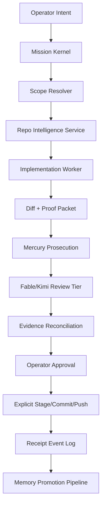
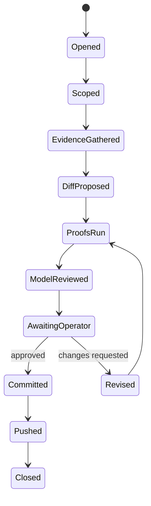

# Principal Systems Architecture Review — Codex Expanded Report

Author: Codex-1
Mode: local repository evidence synthesis
Date: 2026-07-23
Prompt: `ogz-meta/inbox/fable/2026-07-22/principal-systems-architecture-review-prompt.md`

## Scope Correction

The first Codex report was too compact for the mission. The prompt did not ask for a summary. It asked for a principal systems architecture review of the engineering runtime around OGZPrime: runtime, process, repository intelligence, verification, memory, receipts, mission flow, capabilities, orchestration, governance, build-vs-buy, migration, risks, failure modes, and what to preserve or replace.

This expanded report is the Codex repair pass. It does not replace Mercury, Fable, or Kimi. It gives the Codex answer at the level the original prompt required.

## Executive Judgment

OGZPrime has evolved into two overlapping systems:

1. A production trading engine: `run-empire-v2.js`, `foundation/ConfigLoader.js`, `core/StateManager.js`, `core/TradingLoop.js`, `core/OrderExecutor.js`, broker adapters, strategies, dashboards, ledgers.
2. An engineering operating system growing around it: doctrine, Alignment, Mercury, inbox reports, cognition-history, gates, pipeline/slash-router, receipt files, model review tiers, git discipline, P0, red-on-parent tests, config-boundary scans.

The second system exists because freehand human/AI editing repeatedly failed. The right next architecture is not "better prompts." The right architecture is a typed, event-sourced engineering runtime that turns every meaningful repository mutation into an inspectable mission with scope, evidence, model critiques, proof class, operator approval, commit, and replayable receipts.

The current assets are valuable, but they are still too ad hoc. Mercury, Fable, Kimi, Codex, and local tools need to sit behind stable process contracts. Models are workers and reviewers. The durable asset is the process.

## Current System Evidence

| Concern | Current file evidence | Read |
|---|---|---|
| Top-level runtime | `run-empire-v2.js:3-5` loads `ConfigLoader` first | Runtime already knows config must be first-class. |
| State source of truth | `run-empire-v2.js:338-340` gets `StateManager`; `core/StateManager.js:1-25` defines invariants | Correct state center exists, but every mutation path must remain audited. |
| Config authority | `foundation/ConfigLoader.js:1-10` states only this file reads env and config freezes after load | Right doctrine exists; mutation surfaces still require scanners/contracts. |
| Backtest override cage | `foundation/ConfigLoader.js:3730-3765`, `foundation/ConfigLoader.js:4304-4347` | Good direction: one explicit override cage, mode-checked. |
| Strategy orchestration | `core/StrategyOrchestrator.js:1-19`, `core/StrategyOrchestrator.js:2118-2159` | Winner-takes-all strategy ownership is correct. |
| Entry and exit flow | `core/TradingLoop.js:1-17`, `core/TradingLoop.js:1384-1495`, `core/TradingLoop.js:1497-1545` | Exit-before-entry is explicit; refusal authority must stay narrow. |
| Execution truth | `core/OrderExecutor.js:29-52`, `core/OrderExecutor.js:991-1038`, `core/OrderExecutor.js:1040-1090` | Order/intent/fill truth belongs here, not dashboard or strategy modules. |
| Broker abstraction | `brokers/IBrokerAdapter.js:19-24`, `brokers/IBrokerAdapter.js:31-81`, `brokers/IBrokerAdapter.js:87-137` | Adapter contract exists; needs conformance tests by adapter. |
| Mercury review tier | `trai_brain/mercury-bridge/adversarial-review.js:16-29`, `trai_brain/mercury-bridge/adversarial-review.js:241-260` | Correct prosecution/review shape, but provider identity must be explicit. |

## Overall Target Architecture

Build an Engineering Runtime Kernel around OGZPrime. The kernel owns mission lifecycle, repo intelligence, verification, receipts, and governance. OGZPrime becomes one workload running under the kernel.



The important constraint: no model, hook, reviewer, pipeline stage, or report system owns commit authority. The only commit authority is an explicit operator approval event.

## Runtime Architecture

### Current Runtime Hierarchy

The production runtime begins in `run-empire-v2.js`.

Observed construction path:

1. `foundation/ConfigLoader` loads first.
2. `StateManager` singleton becomes trading-state owner.
3. `ExitContractManager` owns per-strategy exit contracts.
4. `ConfigLoader` applies backtest config overrides only in caged backtest contexts.
5. `RiskManagerConfig` builds risk configuration.
6. `IndicatorEngine`, strategy modules, `StrategyOrchestrator`, `SessionRouter`, broker adapters, `OrderExecutor`, and `TradingLoop` are wired.

The target architecture should leave this runtime intact where it works. Do not rewrite the bot into an agent framework. Wrap it with a better engineering process.

### Target Engineering Runtime Services

| Service | Responsibility | Current asset to preserve | Required refactor |
|---|---|---|---|
| Mission Kernel | Mission state, scope, approvals, lifecycle | slash-router/pipeline ideas | Replace ad hoc arrays/scripts with typed state machine. |
| Repo Intelligence | Index, graph, symbol refs, config readers, mutation scans | Mercury indexer, Serena/tree-sitter, config-boundary detector | Split retrieval, graph, and model reasoning. |
| Verification | Tests, gates, P0, red-on-parent, static contracts | P0 gate, Jest, detector scripts | Add proof-type metadata and exercised-path claims. |
| Receipt Store | Durable evidence | inbox, cognition-history, run ledgers | Event-source receipts, generate markdown views. |
| Governance | Human approvals, commit boundaries | Doctrine, AGENTS, fourth-shape lane | Make operator approval a typed event. |
| Provider Router | Mercury, Fable, Kimi, local Qwen | mercury-bridge provider abstraction | Explicit provider identity and budget controls. |

## Engineering Process Architecture

### Current Problem

The project has strong rules, but too much depends on humans and agents remembering the rules. That is why config leaks, hidden gates, auto-commit paths, and report-format failures recur.

### Target Process

Every meaningful mutation should follow this event sequence:

```text
mission.opened
scope.declared
prior_art.read
blast_radius.computed
producer.trace.reported
diff.proposed
proof.parent_red
proof.head_green
proof.p0_if_trade_path
review.mercury
review.fable_or_kimi
operator.approved
git.staged_explicit_paths
git.committed
git.pushed
receipt.closed
memory.promoted_if_canonical
```

This process should be implemented as a small deterministic state machine, not as a conversational convention.

### What Should Be Forbidden

1. Auto-advance to commit.
2. Review tooling halting or restarting the trading process.
3. Hidden provider substitution without report label.
4. Markdown reports that hide raw answer bodies in JSON fields without a rendered view.
5. "Green test" claims without a named proof class.

## Repository Intelligence Architecture

Mercury should become a service with four separable layers:

| Layer | Job | Failure if missing |
|---|---|---|
| Eligibility Layer | Decide what is indexed | Poisoned RAG from inbox/cognition dumps. |
| Retrieval Layer | Embeddings and exact chunks | Local reasoning with stale context. |
| Graph Layer | Symbol refs, callers, config readers, mutation paths | Grep misses computed access and indirection. |
| Reasoning Layer | Mercury/Fable/Kimi prompts and verdicts | Model claims without evidence. |

### Required Invariant

Every architecture or code review report must state:

```text
repo_head_sha
index_sha
index_timestamp
tool_mode
provider
known_tool_failures
coverage_gap
```

If index SHA trails HEAD by lane-relevant commits, the report is stale by construction.

### Recommended Tools

| Need | Candidate |
|---|---|
| Code graph | SCIP/LSIF-style graph, tree-sitter, language server index |
| Static analysis | Semgrep, CodeQL, ESLint custom rules |
| Config boundary | Existing `scripts/check-config-boundary.js` plus AST/graph mode |
| Large-context pass | Fable/Kimi/Qwen only as reviewers, not authority |
| Search UI | Sourcegraph-like local code intelligence |

## Verification Architecture

The key change is proof typing.

| Proof type | Proves | Does not prove |
|---|---|---|
| P0 exact | Frozen trade-path behavior did not drift under the P0 profile | A bug path not exercised by P0 is fixed. |
| Red-on-parent | The new test catches the historical bug class | The whole system is correct. |
| Static forbidden scan | Forbidden names/patterns absent from scanned files | Runtime behavior if scan scope is wrong. |
| AST/graph inventory | Readers/writers/callers for a symbol are known | Semantic correctness of the code. |
| Replay | Historical incident no longer reproduces | Unseen incident classes. |
| Model attack | Finds missing reasoning or counterexamples | Final approval without local proof. |

The report packet must say which proof class is being used. It must also state what the proof cannot exercise.

## Memory Architecture

Current memory tiers should be formalized:

| Tier | Meaning | Index policy |
|---|---|---|
| Doctrine | Operator law | Always eligible |
| Specs | Ratified architecture | Eligible |
| Inbox | Correspondence / reports | Not law until promoted |
| Cognition-history | Raw receipts and model runs | Query on demand, not canonical law |
| Ledger/archive | Intake and historical artifacts | Stale until verified |

The target runtime needs a promotion command:

```text
promote-report --from inbox/... --to specs/... --with operator-approval
```

Without promotion, reports are evidence, not doctrine.

## Receipt Architecture

Markdown is useful for humans, but receipts should be structured first.

### Event-Sourced Receipt Schema

```json
{
  "event_id": "uuid",
  "mission_id": "uuid",
  "event_type": "review.completed",
  "created_at": "ISO-8601",
  "actor": "mercury|fable|kimi|codex|operator|test-runner",
  "repo_head": "sha",
  "scope": ["fileA", "fileB"],
  "inputs": ["prompt path", "diff path"],
  "outputs": ["report path"],
  "proof_class": "p0|red_parent|ast|graph|manual_read",
  "status": "pass|fail|degraded|blocked",
  "coverage_gap": "string"
}
```

Markdown reports should be generated views of this log, not the only source.

### Receipt Invariant

Every report must be readable in git without custom tooling. If raw JSON is committed, a rendered markdown extraction must be committed beside it.

This exact failure happened in the first packet: Fable had a 512 KB raw JSON receipt but only 11 physical lines. The repair is to commit `codex1-result-principal-architecture-fable-independent.md` as the human view.

## Mission Architecture

Define mission kinds:

| Mission kind | Required phases |
|---|---|
| Report-only audit | scope, evidence, model reports, no code edits |
| Hot-path code fix | producer trace, diff, tests, Mercury, P0, operator approval |
| Config migration | before/after reader inventory, parity, P0 |
| Strategy campaign lane | baseline, repair, wiring gates, P0, tournament later |
| Tooling repair | red test against parent, self-audit, no trading P0 unless trade path touched |
| Runtime deploy | env preflight, active-position check, restart contract, smoke proof |

The mission kernel should refuse to mix mission kinds unless the operator explicitly widens scope.

## Capability Architecture

Capabilities should be separately declared:

```text
read_repo
read_git
run_tests
run_mercury
run_fable
run_kimi
write_report
edit_code
stage_git
commit_git
push_git
restart_pm2
```

Each mission gets a capability set. A report-only architecture mission needs `read_repo`, `run_models`, `write_report`, `commit_report`, `push_report`. It does not need `edit_code` or `restart_pm2`.

## Orchestration Architecture

Use an explicit queue with durable state:



The model layer should not drive state transitions that stage/commit/push. It can recommend. Operator approval transitions the state.

## Governance Architecture

Governance should enforce:

1. One branch/worktree law unless Trey names a ref.
2. Explicit stage paths only.
3. No auto-ship.
4. No verifier stop/restart authority.
5. Report-only artifacts commit immediately when written.
6. Production code waits for diff approval.
7. Every model answer has provider identity and evidence quality.

Governance should be machine-checkable. If a rule is not checkable, write it as doctrine and then add a detector when the failure class recurs.

## Build vs Buy

| Problem | Internal build | External candidate | Recommendation |
|---|---|---|---|
| Mission kernel | Required, because the workflow is unique | Temporal/Dagster as runtime substrate | Build kernel; consider Temporal for durable execution. |
| Repo code graph | Not worth fully inventing | Sourcegraph/SCIP/LSIF/tree-sitter/CodeQL | Use existing graph tech, wrap with OGZ evidence rules. |
| Static contracts | Project-specific | Semgrep/ESLint/CodeQL | Use Semgrep/ESLint for pattern contracts; keep custom domain checks. |
| Receipts | Domain-specific | EventStoreDB/Postgres/SQLite | Build schema; store in SQLite/Postgres plus markdown exports. |
| RAG storage | Commodity | Postgres/pgvector/Qdrant/LanceDB | Use commodity vector store; keep eligibility and SHA semantics internal. |
| Multi-model routing | Mostly commodity | LiteLLM/OpenAI-compatible APIs | Use provider abstraction; enforce identity/budget/secrets policy internally. |
| CI | Commodity | GitHub Actions | Use CI for reproducible gates; local gate runner stays for VPS reality. |

## Migration Strategy

### Phase 0 — Stop Making Receipts Hard To Read

Immediate:

1. Every raw JSON model output gets a rendered markdown extract.
2. Every model report states provider, model, invocation, exit status, and coverage gap.
3. Every report commit includes all files needed to read it from git.

### Phase 1 — Typed Mission State

Create a mission ledger under `ogz-meta/cognition/mission-ledger/` or a small SQLite DB:

```text
mission_id
mission_kind
scope
current_state
allowed_capabilities
required_proofs
operator_decision
artifact_paths
```

### Phase 2 — Proof Class Registry

Define proof classes and report requirements:

```text
p0_exact
parent_red
head_green
ast_reader_inventory
graph_caller_inventory
runtime_smoke
manual_repo_read
model_attack
```

### Phase 3 — Mercury Service Split

Split Mercury into:

1. `indexer`
2. `retriever`
3. `graph`
4. `react-agent`
5. `review-formatter`

No single Mercury answer should be allowed to hide toolfail behind a verdict.

### Phase 4 — Workflow Engine

Replace slash-router arrays and shell-driven stage chains with a deterministic mission runner.

### Phase 5 — Productize Engineering OS

Once the process is stable around OGZPrime, extract it into a reusable "engineering runtime" package. OGZPrime becomes the reference workload.

## Expected Risks

1. More process without better proof.
2. Model providers burning budget on broad prompts.
3. Raw artifact sprawl continuing under new names.
4. Over-indexing non-canonical inbox/cognition-history data.
5. P0 treated as universal proof.
6. Graph tools timing out and agents silently falling back to grep.
7. Human-readable docs diverging from structured receipts.
8. Mission state machine becoming too rigid for urgent production response.
9. Commit discipline breaking under parallel agents.
10. Engineering OS work delaying trading-engine fixes.

## Failure Modes To Design Against

| Failure mode | Design countermeasure |
|---|---|
| Hidden config mutation | Config reader graph + mutation contract + hermetic backtest poison-env test |
| Silent report summary | Minimum deliverable schema + rendered markdown extraction |
| Stale index review | Index SHA/timestamp required in report |
| Toolfail verdict | Verdict cannot be stronger than evidence quality |
| Auto-commit | Commit authority only from operator approval event |
| Runtime restart by tool | No PM2 capability in verification missions |
| False dashboard truth | Dashboard data must cite producer and runtime scope |
| Broker/runtime desync | Broker readback wins when available; webhook no-readback is operator-confirmed |
| Cross-symbol poisoning | State/pattern/ledger keys carry symbol, venue, timeframe |
| Backtest/live divergence | Backtest uses live execution pipeline with explicit data-mode substitutions only |

## Strongest Criticism Of This Proposal

The architecture can become its own bureaucracy. A process that requires five reports to fix one obvious typo will be bypassed. The solution is not fewer rules; it is tighter automation around the rules that matter.

The safe path must be the shortest path:

```text
declare scope -> produce evidence -> show diff -> approve -> commit
```

Anything beyond that should be conditional on risk class.

## What I Would Preserve

1. `ConfigLoader` as the config authority.
2. `StateManager` as runtime trading-state owner.
3. `BrokerFactory` / `IBrokerAdapter` as broker boundary.
4. `StrategyOrchestrator` winner-takes-all architecture.
5. P0 exactness as drift detector.
6. Red-on-parent proof culture.
7. Mercury adversarial framing.
8. Fable/Kimi as independent review seats.
9. Doctrine/Alignment as canonical law.
10. Inbox report discipline.

## What I Would Replace

1. Raw JSON-only model reports.
2. Ad hoc pipeline/slash-router stage arrays.
3. Provider-ambiguous labels like "Fable" when the actual provider is Kimi.
4. Report claims without proof class.
5. Broad repo scans that do not state coverage.
6. Markdown-only receipts as source of truth.
7. Any hidden commit/stage/push path.

## What I Would Build Differently Today

If I inherited the ecosystem today, I would:

1. Freeze current doctrine/spec eligibility.
2. Build a typed mission ledger.
3. Require rendered markdown for every raw model output.
4. Attach provider/model/index SHA/proof class to every report.
5. Split Mercury into retrieval, graph, and reasoning layers.
6. Add a proof-class registry.
7. Convert P0/red-parent/static scans into typed receipts.
8. Move every commit/push through explicit operator approval events.
9. Build a mission dashboard showing current lane, dirty files, proof status, and model verdicts.
10. Only after that, extract the reusable engineering OS.

## Bottom Line

The current system has the right instincts: adversarial verification, receipts, doctrine, config ownership, anchored gates, and model plurality. The next step is to stop relying on agents to remember those instincts. Put them into a small runtime kernel with typed mission state, typed receipts, model-provider transparency, and proof-classed verification.

The product is not autonomous coding. The product is trustworthy engineering under human governance.
