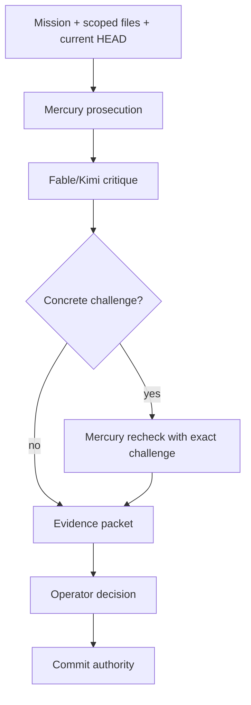

# Principal Systems Architecture Review — Codex Report

Author: Codex-1
Mode: local repo evidence review
Prompt: `ogz-meta/inbox/fable/2026-07-22/principal-systems-architecture-review-prompt.md`
Timestamp: 2026-07-22

## Verdict

OGZPrime already contains the raw ingredients for a durable engineering operating system: doctrine, receipts, Mercury, pipeline metadata, config ownership work, backtest gates, decision ledgers, and symbol/session routing. The problem is that the assets are still too embedded in repo-specific scripts and too dependent on social discipline. I would preserve the evidence culture, but extract it into a smaller, typed, event-sourced engineering runtime with strict interfaces between mission planning, repository intelligence, verification, receipts, and commit authority.

## Current Runtime Evidence

Top-level runtime entrypoint is `run-empire-v2.js`. It loads `foundation/ConfigLoader` first at `run-empire-v2.js:3-5`, then instantiates the trading runtime through singleton state, broker factory, strategy orchestration, session routing, trading loop, and order execution.

Key ownership boundaries currently visible:

| Boundary | Current owner | Evidence | Architectural read |
|---|---|---:|---|
| Config truth | `foundation/ConfigLoader.js` | `foundation/ConfigLoader.js:1-10`, `foundation/ConfigLoader.js:4304-4347` | Correct center of gravity, but still has mutation surfaces that need continued contract tests. |
| Runtime state | `core/StateManager.js` | `core/StateManager.js:1-25`, `core/StateManager.js:404-430` | Correct source-of-truth intent; persistence/reconciliation must remain broker-confirmed, not dashboard-confirmed. |
| Strategy selection | `core/StrategyOrchestrator.js` | `core/StrategyOrchestrator.js:1-19`, `core/StrategyOrchestrator.js:2118-2159` | Winner-takes-all architecture is cleaner than pooled confidence; remaining risk is config/toggle drift and swallowed strategy errors. |
| Entry/exit loop | `core/TradingLoop.js` | `core/TradingLoop.js:1-17`, `core/TradingLoop.js:1384-1495`, `core/TradingLoop.js:1497-1545` | Exit-before-entry path is explicit; halt/refusal authority must stay narrowed and documented. |
| Execution truth | `core/OrderExecutor.js` | `core/OrderExecutor.js:29-52`, `core/OrderExecutor.js:991-1038`, `core/OrderExecutor.js:1040-1090` | Best place for broker-confirmed truth; exit-intent reconciliation is the right class of repair. |
| Broker contract | `brokers/IBrokerAdapter.js` | `brokers/IBrokerAdapter.js:19-24`, `brokers/IBrokerAdapter.js:31-81`, `brokers/IBrokerAdapter.js:87-137` | Adapter contract exists and should become schema-tested across every broker implementation. |
| Mercury review tier | `trai_brain/mercury-bridge/adversarial-review.js` | `trai_brain/mercury-bridge/adversarial-review.js:16-29`, `trai_brain/mercury-bridge/adversarial-review.js:241-260` | Good separation of prosecution and critique, but the review tier must label actual provider identity. |

## Architecture I Would Build

### 1. Engineering Runtime Kernel

Extract the repo-specific workflow into a portable `EngineeringRuntime` package with five typed services:

| Service | Responsibility | Current assets to preserve |
|---|---|---|
| MissionService | Parse mission, scope, approval state, work lane, allowed files | `ogz-meta/pipeline.js`, slash-router contracts, doctrine |
| RepoIntelligenceService | Index, symbol graph, call graph, retrieval, stale-index checks | Mercury indexer, Serena/tree-sitter path, config-boundary detector |
| VerificationService | Run tests/gates/static checks and store receipts | P0 gate, red-on-parent tests, config boundary scans |
| ReceiptService | Append-only evidence, diff binding, review packets, run ledgers | `ogz-meta/inbox`, cognition-history, run ledgers |
| GovernanceService | Operator approvals, commit authority, no auto-ship law | fourth-shape pipeline work, AGENTS/Doctrine |

The kernel should be model-agnostic. Mercury, Fable, Kimi, local Qwen, and future models are providers, not architecture.

### 2. Event-Sourced Receipts

The current receipt culture is valuable but file-layout-heavy. Replace ad hoc markdown-only receipts with append-only typed events:

```text
mission.created
scope.approved
repo.indexed
tool.invoked
test.failed_parent
diff.proposed
review.completed
operator.approved_commit
commit.created
push.completed
```

Markdown reports remain human views generated from the event log. This gives replay, audit, and deterministic reconstruction.

### 3. Repository Intelligence

Mercury should be split into:

| Layer | Job |
|---|---|
| Index layer | embeddings, chunks, exact SHA/index timestamp, eligibility rules |
| Graph layer | tree-sitter symbols, call graph, config-reader graph, mutation graph |
| Evidence layer | file:line citations, command receipts, test artifacts |
| Reasoning layer | Mercury/Fable/Kimi prompts and answers |

The strongest invariant: no model verdict is accepted unless it names the indexed SHA and every cited line is resolvable against that SHA.

### 4. Verification Architecture

Preserve red-on-parent and P0 exactness, but separate proof classes:

| Proof class | Use |
|---|---|
| Behavioral red test | Proves a bug existed and the fix changes it |
| P0 anchor | Detects unintended trading-path drift |
| Static contract | Detects forbidden vocabulary, env bypasses, mutation surfaces |
| Graph contract | Detects hidden readers/writers/callers |
| Replay contract | Replays historical incident data through current code |

The biggest improvement is mandatory proof typing. A P0 pass must never be described as proving a path it cannot exercise.

### 5. Memory Architecture

Keep doctrine and session memory, but enforce tiering:

| Tier | Meaning |
|---|---|
| Doctrine | Always-active law |
| Specs | Canonical architecture |
| Inbox | Intake/correspondence, not indexed law unless promoted |
| Cognition-history | Receipts and raw runs, not primary instruction source |
| Ledger/archive | Historical evidence, stale until verified |

Mercury indexing should follow this tiering strictly. The current direction of Alignment + specs eligibility is correct.

### 6. Model Orchestration

Use adversarial review, not consensus:



Provider identity must be explicit. If the bridge calls the review tier Fable but routes to Kimi, the report must say Kimi.

## Build vs Buy

| Need | Build | Buy/use |
|---|---|---|
| Repo symbol graph | Use tree-sitter + LSIF/SCIP style indexing | Sourcegraph Cody/Enterprise, CodeQL where useful |
| Workflow orchestration | Build thin mission layer | Temporal, Dagster, Airflow for durable workflows |
| Static analysis | Build project contracts only | Semgrep, CodeQL, ESLint custom rules |
| Receipts | Build because process semantics are custom | Store in SQLite/Postgres/event log |
| Memory/RAG | Build eligibility + evidence model | Use vector DB only as storage, not policy |
| Multi-model routing | Build provider abstraction | LiteLLM/OpenAI-compatible APIs |
| CI/CD | Use standard CI | GitHub Actions plus local gate runner |

## Top Risks

1. Config ownership drift returns through test helpers or backtest workers.
2. Runtime truth and dashboard truth diverge during partial exits or broker desync.
3. Model review overclaims when tools fail.
4. Inbox/cognition-history contamination re-enters the canonical index.
5. P0 becomes ritual instead of a correctly scoped drift detector.
6. Strategy reports become markdown receipts without executable proof.
7. SessionRouter grows scheduled/multi-venue movement before venue state ownership is fully keyed.
8. Tooling becomes a hidden authority layer again.
9. One-off scripts bypass the kernel because they are faster in the moment.
10. Human trust degrades if reports are not committed/pushed immediately.

## Strongest Criticism Of This Proposal

It can become another process machine if the interfaces are not brutally small. The runtime should not add ceremony to every edit. It should make the safe path the shortest path: one mission, one scope, one evidence packet, one operator decision, one commit.

## Concrete Migration Steps

1. Freeze current doctrine and specs as canonical indexed law.
2. Define a typed receipt schema and generate markdown reports from it.
3. Extract Mercury tool/retrieval/index metadata into a service with SHA-stamped evidence.
4. Add proof-type labels to every gate and report.
5. Move pipeline authority to “report-only until operator approval,” with commit/push as explicit operator events.
6. Convert hot-path architectural laws into static/graph contracts.
7. Build a small local dashboard for mission state: current lane, dirty files, evidence, model verdicts, unresolved risks.
8. Only then generalize beyond OGZPrime into a reusable engineering runtime.

## What I Would Preserve

Preserve the doctrine, P0 anchor concept, red-on-parent habit, Mercury adversarial posture, inbox report discipline, ConfigLoader ownership direction, StateManager as runtime truth, SessionRouter as routing layer, and broker adapter boundary.

## What I Would Replace

Replace ad hoc slash/pipeline scripts with a typed mission kernel, replace markdown-first receipts with event-sourced receipts plus markdown views, replace provider-ambiguous “Fable” naming with explicit model/provider identity, and replace broad search rituals with graph-backed scoped contracts.

## What I Would Build Differently

I would build the engineering process as the product: typed mission state, typed receipts, SHA-bound repo intelligence, proof-classed verification, model-agnostic review seats, and operator-controlled commit authority. The trading bot then becomes the first hosted workload of that engineering OS, not the place where the OS is improvised.
