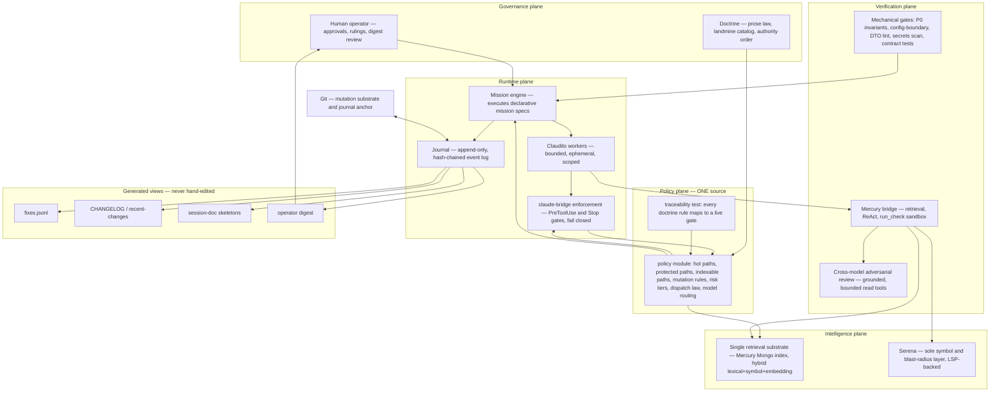
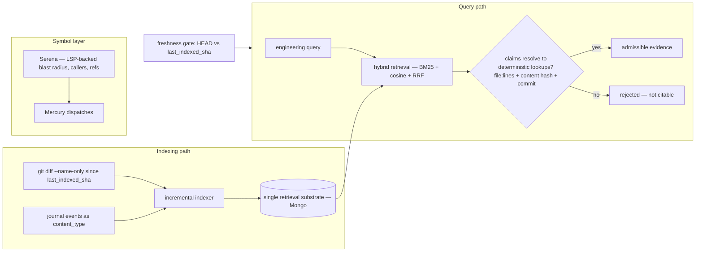
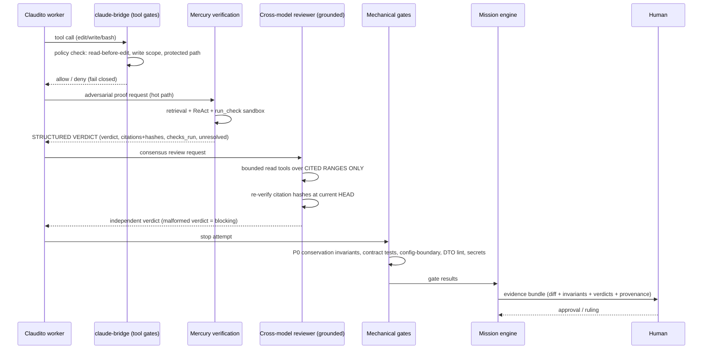

# Principal Systems Architecture Review — Mercury + Fable + Kimi Final

Author: Mercury + Fable + Kimi, final synthesis by Kimi K3
Mode: combined final synthesis over Mercury report, Fable report, and Kimi prior report
Prompt: `ogz-meta/inbox/fable/2026-07-22/principal-systems-architecture-review-prompt.md`
Mercury source: `ogz-meta/inbox/fable/2026-07-22/codex1-result-principal-architecture-mercury-solo.raw.txt`
Fable source: `ogz-meta/inbox/fable/2026-07-22/codex1-result-principal-architecture-fable-independent.md`
Kimi prior source: `ogz-meta/inbox/fable/2026-07-22/codex1-result-principal-architecture-kimi-independent.md`
Started: 2026-07-23T01:56:11.042Z
Ended: 2026-07-23T02:05:01.314Z
Status: success
Raw JSON receipt: `ogz-meta/inbox/fable/2026-07-22/codex1-result-principal-architecture-mercury-fable-kimi-final.raw.json`

# PRINCIPAL SYSTEMS ARCHITECTURE REVIEW — FINAL EVOLVED REPORT

**Seat:** Kimi K3 (third seat, synthesis)
**Mode:** Reconciliation of Mercury Pass 1 + Fable Independent + Kimi Independent
**Date basis:** 2026-07-22 reviews, branch `codex/multi-asset-symbol-state`
**Status:** This document supersedes the three individual reports. Where this document and any seat report disagree, this document states the adjudication and the reason.

---

## 0. Evidence Limits — Read First

This synthesis rests on three uneven evidence bases. Being precise about that is itself an architectural requirement (the failure catalog includes "false confidence").

| Seat | Evidence base | Confidence | Known defects |
|---|---|---|---|
| **Fable** | Five parallel repository surveys (Mercury bridge, Claudito orchestration + claude-bridge, receipts/memory, repository intelligence, trading runtime + gates) plus direct reads of TheDoctrine.md, GRAND-SCHEME.md, MASTER-ROLLOUT.md, claudito cognition refactor plan. Deep, file-and-line cited. | **Highest** | Single-sourced. "Referenced nowhere" claims are grep-class claims over a very large repo and must be re-verified at execution time. Fable itself flags this. |
| **Mercury** | Live tool run against the repo, but shallow: 11 tool calls, 6 files opened, 1 failed open (`ogz-meta/read_only_tools.js` — ENOENT; wrong first guess). Real citations: `core/persistent_llm_client.js`, `core/StateManager.js`, `trai_brain/read_only_tools.js`, `mercury.ignore`, `test/mercury-index-scope.test.js`, `core/trai_core.js:886-904`. | **Medium** | Its own harness flagged `tool_handle_citation` and `unsupported_test_outcome_claim` warnings. Its description of the Mercury bridge "sending full repo tree + config to the LLM" does not match Fable's deeper survey of the same component; treat as unverified. It never found the orchestration, receipts, or repo-intel duplication that Fable documented. |
| **Kimi (prior)** | Zero repository access (no browsing; stated honestly in-report). Research-and-standards synthesis only. | **Low for repo facts; high for external landscape** | The prior report was truncated mid-stream. Nothing in it about repo internals is evidence; only its technology/standards claims carry weight, and those derive from training data — versions, licenses, and project viability may have changed. |

**Additional limits applying to all seats:** no seat executed the full test suite end-to-end during review; repository state is a snapshot of one branch on one day; external project citations (Temporal, SLSA, Sigstore, SCIP, etc.) are from training data and must be re-checked before procurement or adoption.

**Consequence:** every load-bearing repo claim below carries an implicit "re-verify at execution" tag. Phase 0 of the roadmap is deliberately made of cheap re-verifications.

---

## 1. Reconciliation of the Three Seats

### 1.1 Where all three seats converge

Three independent processes, with three different evidence bases, arrived at the same structural convictions. Convergence across independent seats is the strongest signal available in this review (and is itself the reviewer's-diversity principle applied to reviewing):

1. **Mutations must be first-class, recorded events.** Mercury: "every repository mutation as a first-class, verifiable event." Fable: "append-only mission journal; receipts born, not written." Kimi: "event-sourced engineering kernel; the log as the spine."
2. **The enforcement layer is the crown jewel.** Mercury keeps the ReadOnlyToolbox; Fable keeps+hardens claude-bridge; Kimi demands tool-layer (not prompt-layer) enforcement. Nobody proposes touching the fail-closed gate philosophy.
3. **The LLM is a replaceable commodity behind a stable seam.** Mercury's provider-agnostic `persistent_llm_client`, Fable's three-live-providers observation, Kimi's model-gateway recommendation.
4. **Verification needs teeth: structured, cited, blocking.** All three reject advisory-only quality gates.
5. **Repository claims must be evidence-linked or rejected.** Blocking citations (Mercury/Fable), evidence URIs with content hashes (Kimi/Fable).

### 1.2 Disagreements and adjudications

| # | Question | Mercury | Fable | Kimi | **Adjudication** |
|---|---|---|---|---|---|
| 1 | Workflow engine | **Buy Temporal** (twice) | **Reject** — wrong scale; ~300-line journal engine, grep-auditable | Recommend Temporal, but self-criticizes: "80% may be overkill; Postgres + idempotent workers might suffice" | **Fable wins for the target.** Single operator, single VPS, JSONL journal. But adopt Temporal's *discipline*: deterministic fold, all side effects isolated and recorded as events, replay = refold. Temporal/DBOS/Restate is the documented evolution path if the system ever goes multi-machine or multi-operator. |
| 2 | Policy engine | Buy OPA | In-repo policy module | OPA now | **Fable wins.** One `policy` module (data + tiny evaluator) consumed by bridge, finish-gate, indexer, mission engine. OPA is overkill for dozens of rules; if rule count and cross-system policy needs grow, the module's rule data is shaped so Rego adoption later is a translation, not a redesign. |
| 3 | Vector store | Buy Pinecone | Brute-force cosine fine; sqlite-vec/Atlas later behind `searcher.js` | Hybrid; embeddings as recall only | **Fable wins.** Corpus size (~10k chunks per Mercury's own telemetry) does not justify a managed vector DB. Embeddings are never authoritative (all three agree). |
| 4 | Receipt signing | GPG-sign now | Defer; SHA-stamp + trailers now, signing when licensing needs it | in-toto/SLSA/Sigstore | **Synthesis.** Adopt the in-toto attestation *shape* now (Fable already proposes this), add a **hash chain** over the journal now (Kimi's tamper-evidence point — ~free to add day one, painful to retrofit), defer signing; when it comes, use Sigstore (`gitsign`/cosign), not raw GPG (Kimi beats Mercury on key management). |
| 5 | Repo intelligence substrate | Vague "RAG store" | Consolidate on live Mercury Mongo index + Serena as sole symbol layer | SCIP/tree-sitter/CodeQL/Glean | **Fable wins for now** (the Mongo index works and is live; six systems collapse into it). **Kimi supplies the graduation path:** SCIP as interchange format when the symbol layer needs export; Semgrep/ast-grep for the hidden-state/config-boundary rule classes (cheaper than CodeQL private licensing). |
| 6 | `mercury.ignore` fate | Delete after OPA | Fold into policy module | n/a | **Fable wins with a correction to both:** the *semantics* survive as policy data; the file as a second source of truth dies. Do not "delete and re-implement" (Mercury) — migrate the source of truth. |
| 7 | Sandboxing | Not addressed | `run_check` tmpdir snapshot exists; worktrees for EXECUTE | Firecracker/gVisor, default-deny network | **Fable now, Kimi later.** Worktree isolation + the existing `run_check` snapshot suffice at this scale. Adopt default-deny network for agent-executed tooling as near-term hardening. MicroVMs are premature. |
| 8 | Observability | Datadog/New Relic | Journal digest suffices; OTel-aligned field names | OpenTelemetry | **Fable wins.** Align journal/TraceSpine field names with OpenTelemetry span conventions (cheap), defer any vendor. |
| 9 | TLA+/formal methods | Absent | Absent | TLA+ on the orchestration kernel | **Adopt, proportionate.** A ~300-line engine is exactly the size where a small TLA+ spec of the journal state machine is cheap and catches real bugs (Lamport; AWS usage, Newcombe et al. CACM 2015). Optional, Phase 4+. |
| 10 | Prompt contamination | Absent | Lightly addressed | Full threat model (spotlighting, StruQ, CaMeL, AgentDojo, Willison's lethal trifecta) | **Kimi's contribution, scaled down.** Provenance-tagged context, data/instruction separation, verdicts via structured channels. CaMeL-style capabilities are the documented end-state, not the next sprint. |

### 1.3 What each seat uniquely contributed (kept)

- **Fable:** the ground truth. The root-cause diagnosis — *hand-maintained duplication*: three pipeline definitions, three hot-path lists, six index systems, five hand-synced record surfaces, README-vs-config drift. The never-built MiniLM vector index silently falling back to keyword-only. `fixes.jsonl` as the only machine-queried memory with `commit: null` in every sampled row. The lexical keyword-count gate on adversarial proof. The stale-uncheckable 12.3MB bombardier cache. Freshness as metadata, never gated. These findings drive the architecture.
- **Mercury:** file-level corroboration of the keep-list (`persistent_llm_client.js` config validation + health checks, `trai_brain/read_only_tools.js` ignore enforcement + repo-bounding, `StateManager.js` documented invariants, `test/mercury-index-scope.test.js` scope tests), and the correct *instinct* toward event-sourced mutation — its error was procurement, not direction.
- **Kimi:** standards vocabulary and tamper-evidence (in-toto attestation shape, W3C PROV, hash-chained log, transparency-log anchoring), the reconciliation loop (git log vs. journal as the silent-mutation tripwire), fitness-function framing (Ford/Parsons/Kua, *Building Evolutionary Architectures*) for the doctrine-to-gate test family, property-based and mutation testing, N-version diversity theory (Avizienis & Chen 1977), prompt-injection threat model, and the honest scaling caveat.

### 1.4 The synthesized root-cause law

Fable found that the catalogued failure modes are mostly "two copies of the truth, one rotted." The synthesis generalizes this into **three laws** that every section below obeys:

> **Law 1 — One source of truth per concern; everything else is a generated view.**
> **Law 2 — One write path per mutation class; every write path is gated and journaled.**
> **Law 3 — One evidence format per claim class; every claim is verifiable or rejected.**

---

## 2. Overall Architecture

**Name:** the Consolidated Spine. One policy source, one enforcement layer, one mission engine, one journal (the receipt spine), one retrieval substrate, one symbol layer. The Doctrine governs; the journal remembers; the bridge enforces; the engine executes; everything else is a projection or a gate.

Key structural properties:

- **The engine is the journal's only writer.** Workers, gates, and reviewers emit events *through* the engine. This kills the `manifests/current.json` race (Fable finding) without a lock protocol: single-writer append.
- **Git anchors the log.** Journal files are committed; each journal commit is a transparency-log-style checkpoint over the hash chain (pattern: Certificate Transparency, RFC 6962). Tampering with history requires rewriting git history, which the audit mirror detects.
- **Views are generated, never maintained.** `fixes.jsonl`, CHANGELOG, recent-changes, session-doc skeletons, and the operator digest are outputs of `journal render`. Each carries a `generated-from: journal@<range>` header, and a reconciliation check (`render --diff`) fails CI if a projection has been hand-edited (Fable's projection-drift criticism, answered with a mechanism, not a hope).
- **The trading runtime is untouched by this architecture's mechanics.** Nothing in the spine mutates `core/`, `brokers/`, `modules/`, or `run-empire-v2.js`. The spine *observes and gates* work on the hot path; it does not enter it.

---

## 3. Runtime Architecture

The runtime is the engine + bridge + workers + journal, with the determinism discipline imported from durable-execution systems (Temporal's event-history replay model) without adopting the infrastructure.

| Component | Responsibility | Disposition of existing asset |
|---|---|---|
| **Mission engine** | Sole journal writer; executes mission specs; owns stage state machines; sequences `/committer`; runs two-phase ADVISORY→EXECUTE | Replaces `pipeline.js` static arrays, `pipeline-supervisor.js` prose flow, `.claude/commands/*.md` skill-order drift, and the ~150KB of unreferenced phase code (`pipeline-phase7/7b/9/10/12.js`, `execute-mission.js`) — all three pipeline definitions collapse into one spec, with docs generated from it |
| **claude-bridge** | Tool-layer enforcement: read-before-edit, inspection-only Bash, structured-verdict-before-stop, task-contract write scopes | Kept, hardened: consumes policy module; retires `enforce-pipeline.sh` (subsumed; its `^core/` anchor is bypassable by path spelling); harness-agnostic CLI preserved — the `.claude` hook wiring is a thin adapter, and a second adapter for any other harness is the concrete form of "models are replaceable" |
| **Claudito workers** | Bounded, ephemeral, single-purpose execution with structured outputs | Concept kept; implementation hardened: zod/JSON-Schema-validated outputs, stage-scoped tool allowlists and read scopes (today only write scopes are contracted), no shared mutable state except via journal events |
| **LLM client layer** | Provider-agnostic model access | `persistent_llm_client.js` kept as the pattern: strict config validation, health checks, token limits (Mercury citation, corroborated). Additions: provider routing table in the policy module; **model-call cache** keyed by `(provider, model, params, sha256(prompt))` for replay determinism; temperature 0 on verification paths |
| **Journal store** | Append-only JSONL, hash-chained, git-anchored | Replaces mutable `manifests/current.json`; absorbs the functions of the five hand-synced record surfaces |
| **Persistence of truth** | Git remains the mutation substrate | Kept. Post-commit hook stamps SHAs into the journal; commits carry a `Mission-Id:` trailer (`git interpret-trailers`) |

**Determinism rules (the Temporal lesson, self-applied):**
1. State = pure fold over journal events. Replaying the journal must reproduce byte-identical state; a CI check asserts this.
2. All nondeterminism (LLM calls, tool I/O, timestamps) enters only as recorded events with content hashes.
3. Stage handlers are idempotent: re-emitting an event with the same idempotency key is a no-op.
4. LLM determinism is best-effort from providers and is *not* relied upon; the model-call cache is the determinism mechanism. On refold, cached responses are compared by hash; mismatches are flagged, never silently accepted.

---

## 4. Engineering Process Architecture

This is the answer to the Fundamental Engineering Requirement: meaningful mutations emerge only from defined, inspectable, replayable, receipt-generating processes.

```mermaid
stateDiagram-v2
  [*] --> DRAFT: mission spec authored (human or agent)
  DRAFT --> SCOPED: policy check — scope, tier, ownership, indexable paths
  SCOPED --> ADVISORY: read-only analysis, plan, evidence gathering
  ADVISORY --> BLOCKED: gate failure — loop back with verdict attached
  BLOCKED --> ADVISORY: revised plan
  ADVISORY --> AWAITING_APPROVAL: verification PASS with structured verdict
  AWAITING_APPROVAL --> EXECUTE: human approval (tier ≥ 2 always; tier 1 auto with receipts)
  AWAITING_APPROVAL --> DRAFT: rejected with ruling
  EXECUTE --> VERIFYING: diff produced in worktree
  VERIFYING --> COMMIT_PENDING: gates pass — P0 invariants, contract tests, verdict
  VERIFYING --> BLOCKED: gate failure
  COMMIT_PENDING --> COMMITTED: committer lands via single write path
  COMMITTED --> [*]: journal sealed, projections regenerated, digest updated
```

Process rules:

1. **Missions are data, not code.** A mission is a zod-validated declarative spec: intent, scope (paths + risk tier), acceptance invariants declared *up front* (Law: no green test without a stated invariant), stage graph, gate conditions, loop-back rules, approval points, authority budget. Human-readable pipeline docs are *generated from the spec* — this is how the three drifting pipeline definitions die permanently rather than politely.
2. **Two-phase ADVISORY→EXECUTE survives unchanged.** It is the doctrine's production-approval rule in code; Fable and the doctrine agree; Mercury's equivalent approval gate concurs.
3. **Invariant-first execution.** Every mutation-tier mission declares verifiable acceptance predicates before EXECUTE. The VERIFYING stage checks that the declared invariants map to executed checks — the direct counter to "green tests that failed to prove intended invariants."
4. **Exploration missions are the sanctioned escape hatch.** Read-only scope, full journal trail, zero mutations, cheap to start. This answers the "you will if you can" failure mode: a runtime that permits only heavy formal missions gets bypassed under pressure. Discretionary work stays observable instead of going underground (Fable principle 7; Kimi's escape-hatch caveat concurs).
5. **Micro-missions must be genuinely cheap.** If the median mission costs more ceremony than a 5-line fix is worth, the process fails its own purpose. Target: tier-1 mission overhead < 60 seconds of human time.
6. **Process chaos (self-testing the process).** The catalogued failure modes become an injected-fault suite: silent mutation attempt, stale-citation verdict, keyword-stuffed fake proof, ignored-path write, config-boundary leak. The pipeline must catch all of them before changes to the pipeline itself ship (chaos-engineering principles applied to the engineering process; mutation testing lineage: DeMillo, Lipton & Sayward 1978).

---

## 5. Repository Intelligence Architecture

**Consolidation: six systems → one substrate + one symbol layer.** (Fable's central structural finding; Mercury never saw the duplication; Kimi's standards become the graduation path.)

| Existing system | Disposition |
|---|---|
| Mercury Mongo index (hybrid cosine + BM25 + RRF; embedding-identity quarantine at `mongo-store.js:218-239`) | **Kept as the single retrieval substrate.** Genuinely sophisticated engineering (Fable). |
| MiniLM semantic vector path (`rag-embeddings.js`) | **Deleted** (forensic archive first). Never built; has silently fallen back to keyword-only since inception and its consumers don't know — a false-confidence machine. |
| Keyword RAG (`rag-query`, `rag_index.json` 388KB) | **Folded** into the substrate's BM25 side, which it duplicates; `rag_index.json` deleted (defined but never read). |
| Bombardier 12.3MB call-graph cache (March vintage) | **Replaced** by Serena; zero-staleness-check caches are hallucination amplifiers. |
| dep-scanner regex graph | **Replaced** by Serena. |
| Broken Mercury bridge forks in `ogz-meta/` (`indexer_1`, `ask_1`, `mongo-store_1`) | **Deleted** (forensic archive; would throw MODULE_NOT_FOUND). |
| `tools/serena-bridge.js` (LSP-backed, already feeding blast-radius into Mercury dispatches) | **Promoted to sole symbol/blast-radius layer.** It already works and already overlaps four of the six. |
| Sourcegraph | **Kept** as the human exploration surface. |
| Pharaoh MCP | **Wire programmatically or drop** from the automated story — interactive-auth MCP cannot anchor a pipeline. |

**New mechanisms:**

1. **Incremental indexing.** Reindex keyed on `git diff --name-only <last_indexed_sha>`; full rebuilds remain available but cease to be the only path (Fable Phase 2).
2. **Freshness as a gate, not metadata.** The index stores `last_indexed_sha`. `ask.js` compares `HEAD..last_indexed_sha`: if any changed file intersects the mission's scope (hot-path files always intersect), hot-path verification is **blocked** until reindex; docs-tier work gets a loud warning. Reindex stays operator-commanded per doctrine — staleness simply becomes loud. This is the single highest-value ops fix in the whole review: today the anti-hallucination system can silently serve pre-change truth.
3. **Journal and ledger events become a `content_type` in the substrate.** Retrieval over engineering history uses the same machinery as retrieval over code (this was DEC-015 in April, unimplemented until now).
4. **Retrieval honesty.** Hybrid retrieval (lexical + symbol + embedding) with a hard rule: **embeddings are recall only, never authority.** Every natural-language claim about the repository must resolve to a deterministic lookup (file, line range, content hash, commit) before it is admissible in a verdict. This is the counter to both "incomplete repository search" and "repository hallucination."
5. **Graduation path (documented, not built):** SCIP as the symbol interchange format when export/interop is needed; sqlite-vec or Atlas Vector Search behind `searcher.js` if corpus scale ever demands it — a data-layer change, not an architecture change; Semgrep/ast-grep rules for the hidden-state and config-boundary pattern classes.

---

## 6. Verification Architecture

The defense-in-depth stack, in order of trust (lowest layer most trusted):

**Changes with teeth (all three seats converged here):**

1. **Structured verdict contract replaces keyword counting.** `ask.js` emits `{verdict, citations[] (path, lines, sha256, commit), checks_run[], unresolved[], reviewer{model, provider, context_hash}}`. The finish-gate consumes the object. The lexical adversarialness heuristic (counting keywords — a lexical gate on a semantic property, Fable's finding) is deleted.
2. **Citation gates become blocking, not advisory.** `react-loop.js:599-609`'s answer-quality assertions (missing file:line citation, uncited `run_check` claim) flip from warning flags to hard gates for hot-path missions. Mercury's own run in this review carried those warnings — the system flagged its reviewer and let it pass anyway. That ends.
3. **Stale-citation detection.** At gate time, every citation's content hash is re-verified against current HEAD. A citation to a line that has since changed fails the gate. This is the mechanical kill for "Mercury citing a stale line."
4. **The cross-model reviewer gets eyes.** The Fable consensus pass currently has *no repository read tools* (`adversarial-review.js:246`, Fable finding) and cannot catch a plausible-but-wrong citation. It receives read-only tools **bounded to the cited ranges**. Grounded cross-model review is the primary defense against correlated reviewer failure and false confidence; diversity is load-bearing (different provider, different grounding, different context — N-version programming, Avizienis & Chen 1977; the LLM-judge-bias literature supports independent, differently-grounded reviewers). A malformed verdict from the consensus pass is already treated as blocking (fail-safe — keep).
5. **At least one non-LLM check is required for every mutation-tier mission.** No tier-≥1 change lands on model judgment alone (Kimi's diversity mandate, scaled to cost).
6. **P0 invariants primary, golden tuple secondary.** Ledger conservation, tier caps, long-only artifacts become the primary contract; the frozen golden numbers demote to drift tripwire (Fable). **Re-baselining becomes a first-class approved mission type** that atomically updates EXPECTED_P0 + anchor doc + journal — formalizing what anchor-runner/anchor-doc already attempt.
7. **Property-based testing for conservation.** fast-check (JS) generates ledger operation sequences and asserts conservation holds — complementing the frozen tuple with proof over the operation space (QuickCheck lineage: Claessen & Hughes, ICFP 2000). Metamorphic relations (Chen et al. 2018) extend the existing backtest/live equivalence: same seed + same config ⇒ identical decision trace; the existing scope-identity refusal stays.
8. **Seeded-bug library.** Generalizes the c2b/c2c bait-fixture pattern into a planted-bug suite (ledger rounding, config-boundary leak, ignored-path write, stale citation, keyword-stuffed proof). The pipeline must catch 100% before a change to the pipeline itself is trusted. This is mutation testing proportionate to a small team; Stryker is the documented heavyweight option, deferred.
9. **CI mirror on the audit remote.** GitHub Actions runs `scan:secrets`, `lint:dto`, `scan:dto`, config-boundary AST scan, Jest, and the P0 gate on every push. GitHub is doctrine's audit path; today it stores but does not verify — the pushed-vs-verified gap closes.
10. **The trading runtime's invariant culture is preserved at all costs:** the shared backtest/live path, the 177-file contract/ownership/scope test skew, the P0 gate. Known fragility is documented, not touched by this program: god files (ConfigLoader ~4.5k lines, StateManager ~4k, run-empire-v2 ~3.3k), remaining config-boundary leaks (`UnifiedPatternMemory.js:230,248` reading `process.env` directly, Fable finding), and the half-wired multi-symbol migration ("Commit 2/6").

---

## 7. Memory Architecture

Kimi's four-tier decomposition, mapped onto Fable's findings; Mercury's cache-invalidation point absorbed.

| Tier | Content | Truth status | Mechanism |
|---|---|---|---|
| **Facts** | Journal events, receipts, commit links, verdicts, approvals | Immutable, append-only, hash-chained | The journal. *Only* machine-queried memory today is `fixes.jsonl` with `commit: null` in every sampled row (Fable) — that is replaced by commit-linked events at creation. |
| **Derived indexes** | Embeddings, BM25, symbol graph, blast-radius | **Disposable and rebuildable** | The single substrate + Serena. Freshness-gated. Any derived index can be deleted and rebuilt from facts + git without loss — this property is tested, not assumed. |
| **Doctrine** | TheDoctrine.md, landmine catalog, Hookify enforcement catalog, ADRs | Versioned, human-governed prose law | Kept as constitution. Executable projection = policy module. Traceability test binds rule→gate both directions. |
| **Context assembly** | The bundle given to a model for a task | A **pure function** of (task, indexes, doctrine, session) | Content-addressed context bundles: small, targeted, provenance-tagged. "Lost in the Middle" (Liu et al. 2023) is the standing rebuttal to context stuffing. |

**Memory promotion pipeline (closes the loop Fable found open):** session note → intake → human ruling → promoted to doctrine or journaled as fact. Intake older than N days without ruling surfaces in the operator digest as *stalled* — stalling becomes visible without automating authority away.

**Long-horizon context loss counter:** the journal *is* the long-horizon memory. Any historical decision is reconstructable by refold + projection; "median time to reconstruct any historical decision" becomes a measured property (target: < 60 seconds via digest search).

**Prompt contamination defenses (Kimi's contribution, proportionate):**
- All repository content and tool outputs are **untrusted data**: wrapped in provenance-tagged blocks (`[UNTRUSTED: tool output]`) — the
