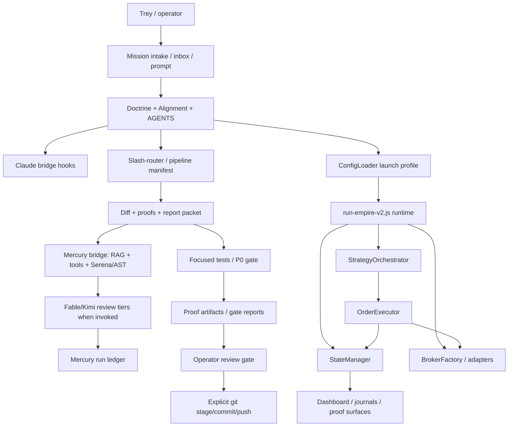

# Principal Systems Architecture Review - Codex Independent Pass

Date: 2026-07-24  
Author: Codex-1  
Repo: `/opt/ogzprime/OGZPMLV2`  
Branch at review: `codex/multi-asset-symbol-state`  
HEAD at review: `8116a576`  
Scope: independent Codex architecture pass for the engineering runtime / AI-assisted engineering OS prompt. This report does not reuse Mercury, Fable, or Kimi answers as primary evidence.

## Executive Verdict

OGZPrime has the bones of a serious engineering runtime: doctrine, launch-profile config ownership, a Mercury verifier with repo tools, a Claude bridge with policy hooks, P0 anchor gates, run ledgers, manifest-based missions, and durable report routing. The system is not just "a trading repo with scripts" anymore. It is becoming an operator-controlled software factory.

The critical gap is that the enforcement plane is still split across too many surfaces:

- Claude-specific hooks in `.claude/settings.json`.
- Mercury bridge policy and run ledger logic under `trai_brain/mercury-bridge/`.
- Slash-router and pipeline manifests under `ogz-meta/`.
- Config ownership and trade runtime law under `foundation/ConfigLoader.js`, `core/`, and `run-empire-v2.js`.
- Human rules in `AGENTS.md`, `ogz-meta/AGENTS.md`, and `ogz-meta/Alignment/`.

That split is the architecture risk. The right next shape is not another loose script. The right shape is one mission-control runtime with typed events, typed proofs, machine-readable ownership, one policy surface, and model outputs demoted to evidence, never authority.

## Evidence Read

I verified current repo state and code paths directly. Notable evidence:

- `.claude/settings.json:2-81` wires Claude hooks for prompt, read, edit/write, bash, post-read, post-edit, and stop.
- `ogz-meta/pipeline.js:63-79` includes Mercury attack, Mercury critic, anchor verify, debugger, validator, forensics, scribe, janitor, and warden stages for write missions.
- `ogz-meta/slash-router.js:55-78` maps `/committer` to `operatorReviewGate`, not git write.
- `ogz-meta/slash-router.js:1917-1950` records operator review required with `commit_hash: null`.
- `ogz-meta/slash-router.js:1956-1963` disables repo-history snapshot inside the pipeline.
- `ogz-meta/pipeline-supervisor.js:203` still contains a `committer` stage descriptor. I did not prove it active; treat it as stale machinery until deleted or marked dead.
- `trai_brain/mercury-bridge/ask.js:22-25` exposes `--adversarial-review`, `--consensus`, `--architecture`, and `--planning`.
- `trai_brain/mercury-bridge/ask.js:162-183` expands architecture and planning prompts into explicit longform evidence modes.
- `trai_brain/mercury-bridge/tool-adapter.js:1177-1240` constrains Mercury `run_check` command execution and only allows read-only git subcommands.
- `trai_brain/mercury-bridge/run-ledger.js:121-146` classifies Mercury verdicts, and `run-ledger.js:217-289` persists run metadata, prompt hash, tool telemetry, full review text, and verdict.
- `trai_brain/mercury-bridge/searcher.js:269-330` fetches all chunks and builds BM25 per query; `mongo-store.js:128-153` pulls active chunks into memory for scoring.
- `foundation/ConfigLoader.js:592-610` resolves launch profiles; `ConfigLoader.js:627-643` builds effective env; `ConfigLoader.js:665-723` owns session-router and execution-mode fields from launch profile.
- `foundation/ConfigLoader.js:1122-1290` validates launch mode, session router, live trading, webhook, broker, and TTP/eval constraints.
- `foundation/ConfigLoader.js:1448-1539` fingerprints, validates, freezes, and timestamps config snapshots.
- `foundation/ConfigLoader.js:4334-4347` keeps runtime backtest overrides caged through `applyBacktestConfigOverrides`, with `setOverrides` labeled Jest-only.
- `core/StateManager.js:404-458` owns process state fields including positions, active trades, symbol halts, PnL, pause state, and runtime timestamps.
- `core/StateManager.js:824-1060` stamps immutable trade identity/scope and blocks simultaneous same-symbol opposite direction.
- `core/StateManager.js:3293-3307` serializes `Map` state atomically; `StateManager.js:3316-3540` reloads state, validates active trade scope, and refuses source-less exposure.
- `core/KillSwitch.js:4-10` claims it blocks all order execution, but scoped search found no production order-path call to `throwIfActive()`.

## Current Architecture Diagram



## Ownership Boundaries

| Plane | Current owner | Evidence | Boundary verdict |
| --- | --- | --- | --- |
| Doctrine | `AGENTS.md`, `ogz-meta/AGENTS.md`, `ogz-meta/Alignment/` | Root AGENTS points to Alignment and full doctrine | Good intent, still partly prose-first |
| Config truth | `foundation/ConfigLoader.js` | Launch-profile resolution, validation, fingerprint, deep-freeze | Strongest current control plane |
| Mission runtime | `ogz-meta/pipeline.js`, `ogz-meta/slash-router.js`, `ogz-meta/manifest-schema.js` | Operator review gate and P0 post gate exist | Good, but legacy/stale supervisor path remains |
| Verifier runtime | `trai_brain/mercury-bridge/` | Agentic CLI, tool adapter, run ledger, Serena imports | Powerful, but retrieval and toolfail trust are still active risk surfaces |
| Client guardrails | `.claude/settings.json`, `trai_brain/claude-bridge/` | Claude hooks enforce read/write/bash/stop policy | Not universal; Codex app is outside this hook plane |
| Trading state | `core/StateManager.js` | activeTrades Map, atomic save/load, immutable scope checks | Much improved, still carries hard startup failure semantics |
| Broker abstraction | `brokers/BrokerFactory.js`, `foundation/IBrokerAdapter.js`, adapters | Factory validates adapter methods; adapters implement common shape | Good base; broker/event truth still needs uniform provenance |
| Anchor truth | `ogz-meta/gates/multi-runtime-gate-runner.js` | Current P0 expected values live in executable gate | Strong tripwire for trading behavior, not enough for engineering-runtime behavior |

## Most Important Independent Finding

The Claude bridge is client-scoped, not repo-scoped.

`.claude/settings.json:13-80` enforces policy for Claude tool usage. This Codex session can read, edit, and commit through Codex tooling without passing through those Claude hook invocations. Git hooks and repo scripts may still catch some problems, but the Claude bridge itself is not a universal enforcement substrate.

This is not a complaint about Claude. It is an architecture boundary:

- Claude bridge hooks are valuable for Claude Code.
- Mercury bridge tools are valuable for Mercury.
- Codex has its own tool lane.
- Desktop Commander has another lane.
- Fable/Kimi/API agents have their own lanes.

Therefore, durable policy must live in repo-native gates and typed manifests, not only client-specific hooks. Client hooks can be adapters to the policy engine, not the policy engine itself.

## Critical Path

### P0 - Prove or fix KillSwitch authority

`core/KillSwitch.js:4-10` claims it blocks every order execution. The class can write and read a durable flag, but a scoped search found no production order-path use of `throwIfActive()`. If this search is complete, the kill switch is a visible flag with insufficient enforcement. That is a white-box contradiction: displayed/declared authority differs from execution authority.

Required next evidence:

- Full caller graph for `isKillSwitchOn()` and `throwIfActive()`.
- If no order-path caller exists, wire the check into the single execution choke point or rewrite the claim so it does not lie.
- Add a red test where `killswitch.flag` exists and the order path refuses before broker submission.

### P1 - Collapse policy to a repo-native engine

The current policy shape is spread between Claude hooks, Mercury tool adapter rules, slash-router stages, manifest stop conditions, shell/git practices, and AGENTS prose. This creates drift.

Target shape:

- One `policy/` package or equivalent under repo control.
- Inputs: actor, tool, path, mission id, branch, dirty status, hot-path flag, proof status.
- Output: allow, deny, report-only, required proof.
- Every client calls the same decision engine: Claude, Codex wrappers, Mercury run_check, pipeline, CI.

Do not jump straight to a heavy external policy engine. Start with typed JSON policy, schemas, and contract tests. Open Policy Agent is a credible later candidate because it is a general-purpose policy engine, but the project first needs stable policy objects and event schemas.

### P1 - Replace prose-owned ownership with a machine-readable ownership map

ConfigLoader is proving the pattern: explicit launch-profile blocks, no hidden defaults, source tracking, fingerprinting, and validation.

Apply the same idea to the engineering runtime:

```json
{
  "owner": "ConfigLoader",
  "surface": "launchProfiles.*.sessionRouter",
  "authority": "runtime-config",
  "may_mutate": false,
  "proof_required": ["config-loader-tests", "p0-if-trade-path"]
}
```

This would stop repeated "who owns this?" archaeology.

### P1 - Normalize receipts into one event envelope

The repo has many receipts: Mercury run ledger, claudito logs, P0 reports, session docs, fix ledgers, inbox reports, manifests, strategy lab artifacts. They are useful but structurally inconsistent.

Build one append-only event envelope:

- `event_id`
- `mission_id`
- `actor`
- `tool`
- `repo_head`
- `dirty_status`
- `input_hash`
- `output_hash`
- `files_read`
- `files_written`
- `proofs`
- `verdict`
- `operator_decision`

Then every report becomes a projection of the event stream, not a hand-written memory pile.

### P1 - Make engineering-runtime P0s

The trading P0 anchor is effective for trade-path drift. It caught real behavior shifts during this buildout, and the current expected values are executable. But the engineering runtime needs its own anchors:

- "No auto-commit path exists."
- "Client hooks cannot be the only enforcement."
- "Mercury toolfail cannot emit a blocking verdict."
- "Report-only reviews cannot mutate runtime."
- "A mission stops at diff/proofs/operator review."
- "A static Codex report can be committed without staging unrelated dirt."

These should be fast contract tests, not broad Jest sprawl.

### P2 - Scale Mercury retrieval deliberately

`searcher.js:269-330` and `mongo-store.js:128-153` currently score by pulling active chunks into memory and building BM25 per query. That is acceptable at current scale, but it is not the future architecture if the repo becomes a multi-product engineering memory system.

Keep the active index filter. Add:

- Golden retrieval prompts with expected file hits.
- Index freshness gate against HEAD for architecture/review runs.
- Chunk provenance and eligibility tests.
- Retrieval performance budget.
- Later: vector-store/native hybrid search if chunk count grows materially.

### P2 - Adopt standard observability before another custom dashboard for agents

Use OpenTelemetry-style traces/metrics/logs concepts for the engineering runtime, even if the first exporter is local JSONL. The key is trace/span/event consistency: mission -> tool call -> file read -> model answer -> test -> commit.

### P2 - Treat provenance as a supply-chain problem

The in-toto/SLSA world is relevant because the problem is "what produced this artifact, under which inputs, and can I trust it?" OGZPrime does not need full enterprise ceremony today, but it does need attestations for:

- reports,
- commits,
- P0 reports,
- Mercury runs,
- Kimi/Fable reviews,
- generated strategy dossiers.

## What To Preserve

1. ConfigLoader's launch-profile ownership model.
2. P0 executable gate as anchor truth.
3. Mercury's agentic tool model and run ledger.
4. Slash-router's operator-review gate replacing auto-commit.
5. Inbox report routing with immediate commit/push for reports.
6. StateManager's immutable trade scope stamping and restart validation.
7. The rule that model outputs are evidence, not authority.

## What To Delete Or Quarantine

1. Any stale pipeline surface that still names git commit as a stage unless it is proven unreachable and documented as dead.
2. Any policy gate that only one client can see but the repo treats as universal.
3. Any receipt format that cannot be tied to commit SHA, prompt hash, actor, and dirty tree.
4. Any runtime declaration that is not read in the execution path, especially safety claims.
5. Any model memory or cognition pile that is not eligible for current retrieval.

## Build vs Buy

| Need | Recommendation |
| --- | --- |
| Policy decisions | Build typed local policy first; evaluate OPA later once the policy object model stabilizes |
| Long-running missions | Keep current manifest runner now; evaluate Temporal only after event schemas stabilize |
| Traces/metrics/logs | Adopt OpenTelemetry concepts now; export locally first |
| Provenance/attestation | Borrow in-toto/SLSA concepts now; no need for full external rollout yet |
| Model orchestration | Keep Mercury default; use Kimi as explicit fourth-eye; keep provider routing opt-in |
| Retrieval | Keep current Mongo active-index model short term; add golden retrieval tests before swapping engines |

## Top 10 Architecture Risks

1. Client-specific enforcement is mistaken for repo-wide enforcement.
2. KillSwitch authority may be declared but not enforced in the order path.
3. Legacy pipeline-supervisor commit stage remains as a stale authority surface.
4. Run ledgers, session docs, manifests, and inbox reports are not one typed evidence model.
5. Mercury retrieval can be stale or under-scoped unless index freshness is enforced per report.
6. Toolfail handling is structurally better now, but any reviewer with failed tools can still create cognitive noise unless reports foreground reliability.
7. ConfigLoader is strong, but compatibility APIs such as `get()` and test override surfaces still need ongoing boundary scans.
8. StateManager startup throws protect integrity but can become operational paralysis if reconciliation tooling is not ergonomic.
9. Huge untracked cognition/ledger piles create review contamination and tool cost drag.
10. White-box dashboards can still drift from runtime truth if proof/public data generators are not governed by the same event envelope.

## Falsifying "The First White-Box Execution Engine"

Current falsification candidates:

- `core/KillSwitch.js:4-10` says kill switch blocks all execution; enforcement caller proof is missing from scoped search.
- `ogz-meta/pipeline-supervisor.js:203` still names a committer stage while current slash-router disables git writes; if unused, it should be marked dead or removed.
- `.claude/settings.json` enforces Claude hooks, but Codex/other agents are not automatically inside that hook model.
- Multiple report/memory stores mean the displayed story can outrun the executable record.

Current supporting evidence for the claim:

- `StateManager.js:953-974` attaches decision ledger skeleton at trade birth.
- `ConfigLoader.js:1448-1539` creates fingerprinted, frozen config snapshots.
- `OrderExecutor.js` stamps broker, execution route, execution venue, and market-data broker fields across entry/exit paths.
- Mercury run ledger records prompt hash, head SHA, dirty status, tool telemetry, and full review text.
- Slash-router now stops at operator review rather than auto-shipping.

Verdict: the claim is plausible as a product direction, not yet proven as a system invariant. To make it true, every externally visible runtime claim must be linked to a proof-producing code path.

## Migration Plan

1. Create a `mission-event` schema and convert pipeline, Mercury, P0, and report commits to emit it.
2. Add a repo-native policy decision module consumed by Claude bridge, Mercury run_check, pipeline, and CI.
3. Add contract tests for no auto-commit, no report-only runtime mutation, no toolfail blocking verdict, and kill switch enforcement.
4. Build an ownership map for config, state, broker, verifier, pipeline, and report surfaces.
5. Add golden retrieval tests and index freshness proof for Mercury architecture/review modes.
6. Normalize inbox report metadata so every report knows model/provider/index SHA/input hash/output hash.
7. Add a lightweight trace viewer over mission events before building more bespoke dashboards.
8. Only then evaluate OPA/Temporal/vector-store migration. Do not buy your way out of a shape problem.

## External References Used

- Open Policy Agent: https://www.openpolicyagent.org/
- Temporal durable execution docs: https://docs.temporal.io/
- OpenTelemetry docs: https://opentelemetry.io/docs/
- in-toto project: https://in-toto.io/
- SLSA/in-toto provenance context: https://slsa.dev/blog/2023/05/in-toto-and-slsa

## What I Did Not Prove

- I did not run PM2 or inspect live runtime.
- I did not run P0 for this report-only artifact.
- I did not run Mercury/Fable/Kimi during this independent Codex pass.
- I did not claim pipeline-supervisor is active; I found a stale-looking committer stage that needs disposition.
- I did not exhaustively enumerate every state owner in the trading runtime; this was scoped to the engineering architecture prompt and the major runtime seams.

## Bottom Line

The system is coming together, but the next architecture win is not another model, not another pile of reports, and not another hook. The next win is a single repo-native control plane that every agent and every tool must pass through, with typed events and proof contracts. That is the path from "hard-working spaghetti" to an engineering runtime that can survive ten years.
